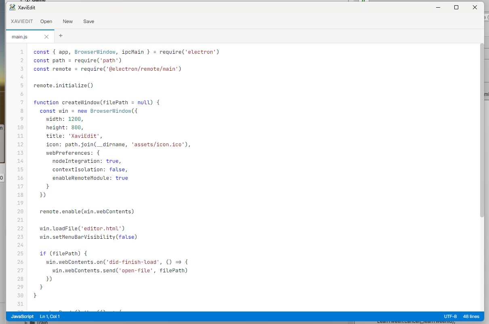

# XaviEdit

A simple, lightweight external script editor built for Unity and everyday programming languages.  
Built with Electron. No autocomplete, no bloat. Just code.

---
<p align="center">
  
</p>

---

## What is it?

XaviEdit is a standalone desktop application that lets you open and edit scripts outside of Unity — or any other project.  
It was born out of frustration with heavy IDEs and the desire for something fast and simple.

---

## Features

- **Syntax highlighting** for C#, JavaScript, TypeScript, Python, C/C++, Java, and more
- **VS-style tabs** — open multiple files at once, just like Visual Studio
- **Line numbering**
- **Silent save** — Ctrl+S saves directly to disk, no dialogs
- **Unity integration** — set XaviEdit as your External Script Editor and it opens files automatically on double-click
- **Lightweight** — no language server, no autocomplete, no indexing

---

## Unity Integration

1. Build or run XaviEdit
2. In Unity, go to **Edit → Preferences → External Tools**
3. Set **External Script Editor** to `XaviEdit.exe`
4. Double-click any `.cs` file in the Project window — XaviEdit opens it instantly

---

## Keyboard Shortcuts

| Shortcut | Action |
|---|---|
| `Ctrl+S` | Save |
| `Ctrl+O` | Open file |
| `Ctrl+N` | New file |
| `Ctrl+W` | Close tab |
| `Ctrl+T` | New tab |
| `Ctrl+Tab` | Next tab |
| `Ctrl+Shift+Tab` | Previous tab |
| `Tab` | Indent (4 spaces) |

---

## Supported Languages

C#, JavaScript, TypeScript, JSX, TSX, Python, HTML, CSS, JSON, XML,  
C, C++, Java, Kotlin, Rust, Go, Shell, Lua, Ruby, PHP, Swift, YAML, TOML, Markdown  
and Unity-specific files (`.meta`, `.prefab`, `.asset`)

---

## Getting Started

```bash
npm install
npm start
```

To build a distributable `.exe`:
```bash
npm run dist
```

Or to get just the portable executable without an installer:
```bash
npx electron-builder --dir
```

---

## Honest disclaimer

XaviEdit is intentionally minimal.  
It has no error checking, no autocomplete, and no understanding of what you're typing.  
It exists because sometimes you just want to open a file, change a value, and save — without waiting for an IDE to reload.

If you need IntelliSense, use Visual Studio or Rider.  
If you need something fast and simple, this is for you.

---

## Author

Tiago Xavier Braga  
[github.com/tiago-xavier-braga](https://github.com/tiago-xavier-braga)
